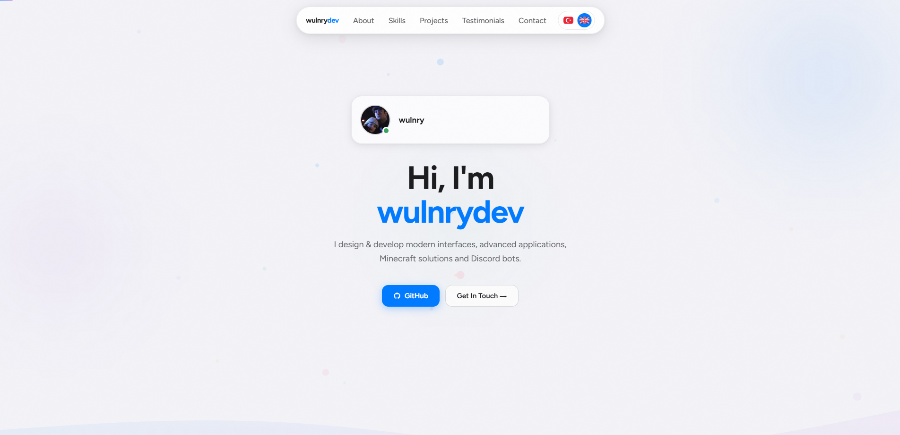
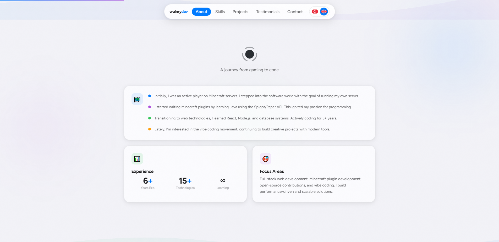
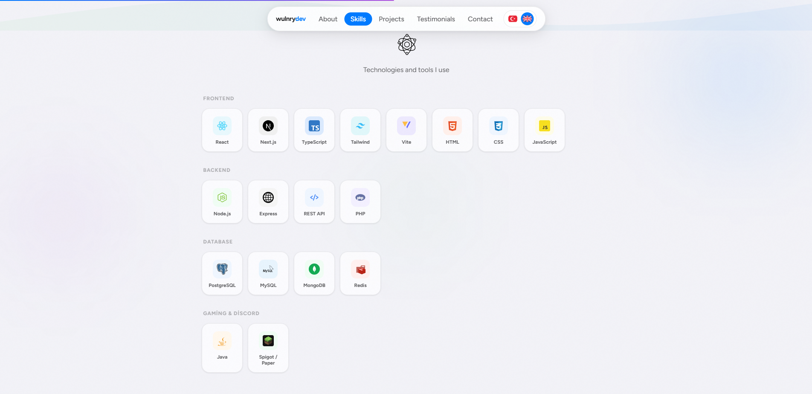
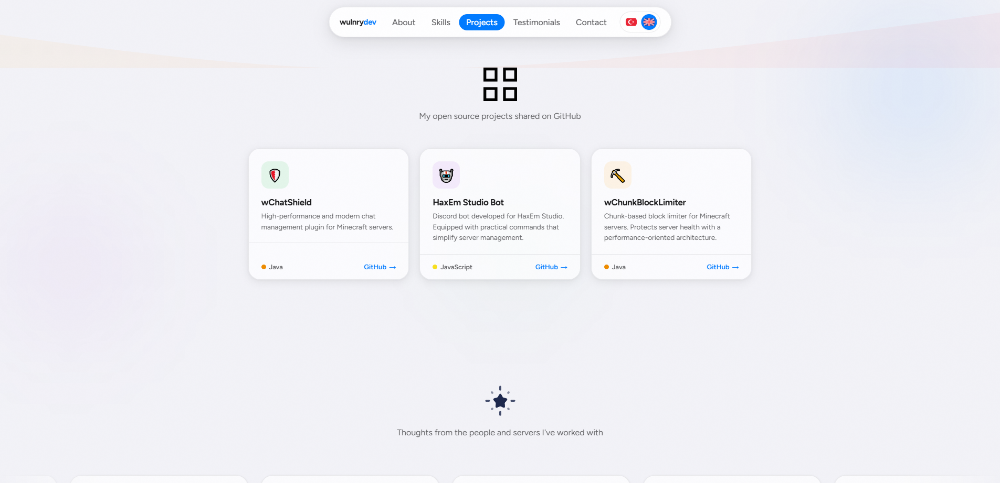
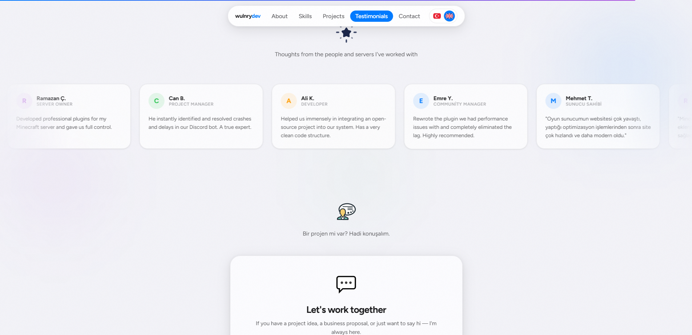

  
  <h1>wulnrydev — Personal Portfolio</h1>
  

    <b>Modern interfaces, advanced applications, Minecraft solutions & Discord bots.</b>
  

  

    <i>A personal portfolio website showcasing my journey from gaming to code.</i>
  

  

    <a href="#english-en">English</a> •
    <a href="#türkçe-tr">Türkçe</a>
  

 

  
    
  &nbsp;
  
    
  &nbsp;
  

 

---

## English [EN]

### About This Project

This repository contains the source code for my personal developer portfolio, designed from scratch to be **modern**, **fast**, and **dynamic**. It features a glassmorphism aesthetic, smooth scrolling, dynamic gradients, and live integration with Discord using the Lanyard API to show my real-time status.

### Features
✨ **Dynamic Discord Status:** Real-time online status and rich presence tracking using [Lanyard](https://lanyard.rest). 
✨ **Responsive Bento Grid:** Modern and clean grid system optimized for both desktop and mobile devices. 
✨ **i18n Support:** Fully animated, smooth Turkish & English language toggle. 
✨ **Zero-Dependency Architecture:** Pure HTML, Vanilla CSS, and JavaScript. No bulky frameworks. 
✨ **SEO Optimized:** Comprehensive OpenGraph tags and structured meta tags for perfect social media sharing.

### Tech Stack
- **Structure:** Semantic `HTML5`
- **Styling:** Custom `CSS3` (CSS Variables, Flexbox, CSS Grid, Glassmorphism)
- **Logic:** Vanilla `JavaScript` (Intersection Observers, Fetch API, LocalStorage)
- **APIs:** `Lanyard REST/WebSocket API`

### Getting Started
Simply double-click the `index.html` file or use an extension like **Live Server** in VSCode. No installation or build steps required.

---

## Türkçe [TR]

### Proje Hakkında

Bu depo, sıfırdan **modern**, **hızlı** ve **dinamik** olacak şekilde tasarlanan kişisel geliştirici portfolyomun kaynak kodlarını içermektedir. Glassmorphism tasarımı, pürüzsüz kaydırma efektleri, hareketli arka planları ve aktif olarak Discord durumumu çeken canlı entegrasyonu barındırmaktadır.

### Özellikler
✨ **Canlı Discord Durumu:** [Lanyard API](https://lanyard.rest) kullanılarak anlık müzik, aktivite veya sunucu durumu gösterimi. 
✨ **Responsive Bento Grid:** Hem mobil cihazlar hem de masaüstü için optimize edilmiş modern ızgara sistemi. 
✨ **i18n Desteği:** Pürüzsüz geçiş animasyonlu, `localStorage` hafızalı %100 İngilizce/Türkçe dil ayarı. 
✨ **Sıfır Bağımlılık (Zero-Dependency):** Sadece saf HTML, Vanilla CSS ve JS kullanılarak inşa edildi. Yük bindiren büyük kütüphaneler yok. 
✨ **SEO Optimizasyonu:** Zengin link önizlemeleri için Twitter kartları ve OpenGraph entegrasyonu.

### Teknolojiler
- **Yapı:** Semantik `HTML5`
- **Stil:** Saf `CSS3` (CSS Değişkenleri, Flexbox, CSS Grid tasarımları)
- **Mantık:** Vanilla `JavaScript` (Performanslı Intersection Observer API)
- **API:** `Lanyard REST/WebSocket API`

### Kullanım
Projeyi çalıştırmak için hiçbir kurulum gerekmez. `index.html` dosyasını tarayıcınızda açmanız veya VSCode üzerinden **Live Server** ile başlatmanız yeterlidir.

---

  <h3>License</h3>
  
Released under the <a href="./LICENSE">MIT License</a>. Feel free to use it for learning and inspiration!

